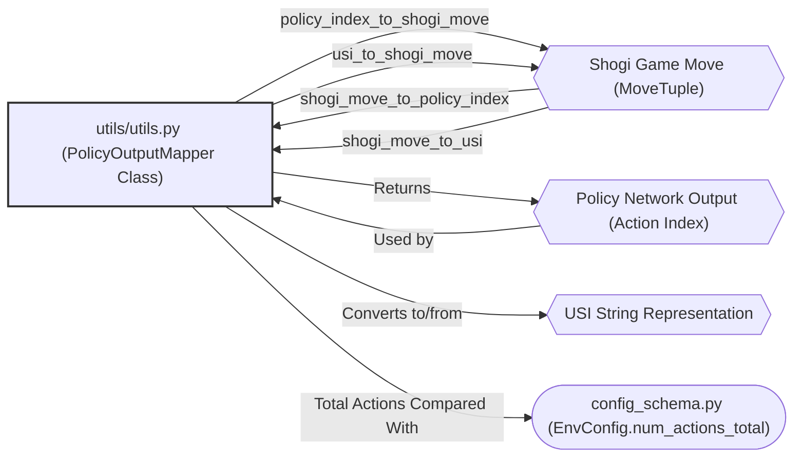
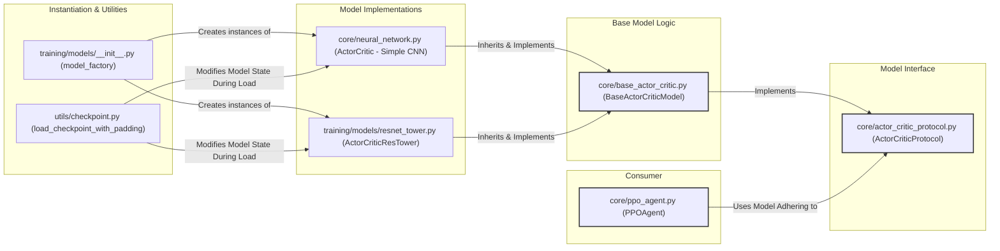
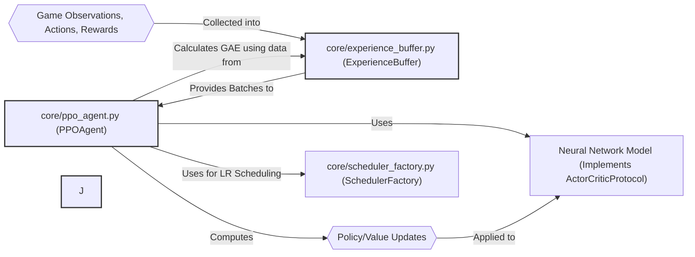
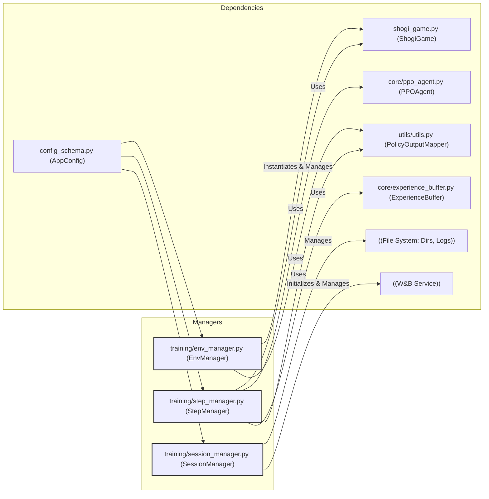
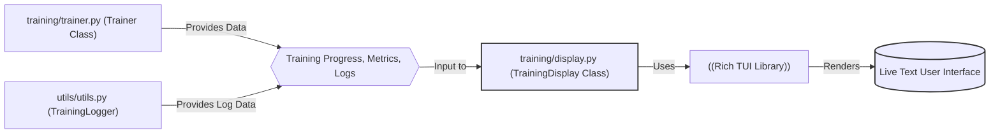
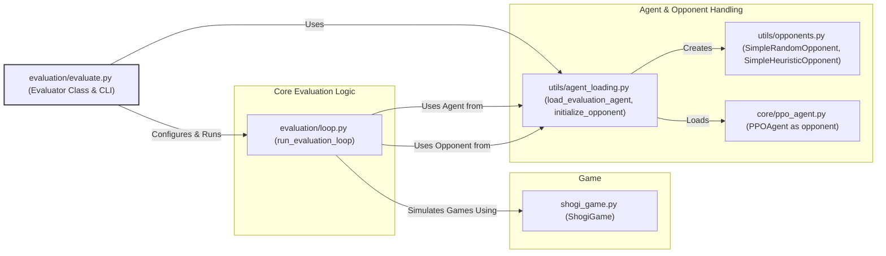
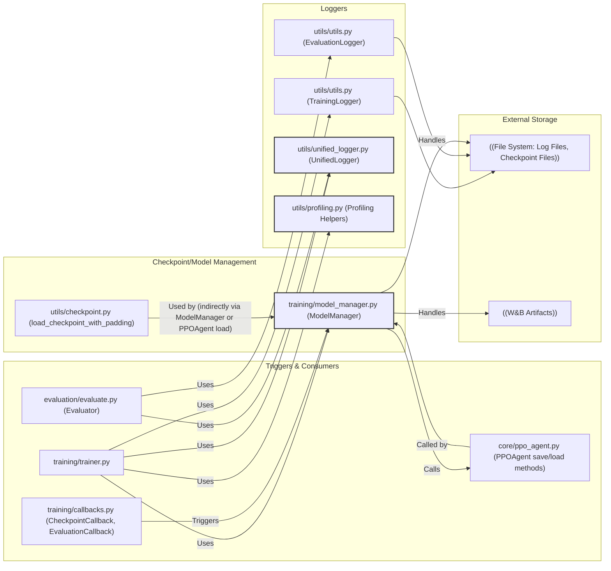
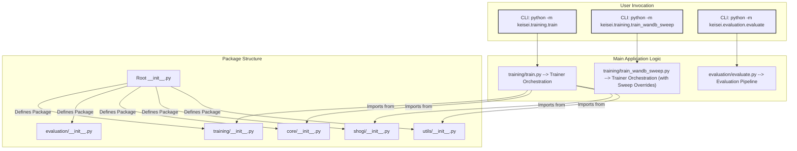

Okay, I've reviewed your `code_map.md` based on the latest code provided, including the PPO core components. Here's the updated plain-Markdown document with changes and observations incorporated.

I've tried to keep unchanged content identical and have added comments where updates or new observations from my review are relevant.

---

## 1. Configuration Management

**Sections & Purpose:**
Pydantic schema definition, loading from YAML/JSON, application of CLI/env overrides. Ensures consistent and validated configuration throughout the application.

**Core / Supporting Files:**

* `config_schema.py`
* `utils/utils.py` (`load_config`, `FLAT_KEY_TO_NESTED`) * `training/train.py`
* `training/train_wandb_sweep.py`
* `evaluation/evaluate.py`

**Reviewer Watch-list (issues & risks):**

* **Device String Validation:**
  `EnvManager` could centralise validation for device strings (e.g., `cuda:0` vs `cuda:O`). Currently, typos might pass silently.
* **Override Complexity:**
  Document override precedence in `load_config` clearly.
* **Synchronization:**
  Maintain alignment between `default_config.yaml` and `config_schema.py`.
* **Redundancy:**
  CLI parsing logic is duplicated between `training/train.py` and `training/train_wandb_sweep.py`. **Accuracy:** Almost Certain

---

## 2. Shogi Game Engine

**Sections & Purpose:**
Core game logic, including piece definitions, board representation, move execution, rule validation (checks, drops, promotion), and game state I/O (SFEN, KIF, observation tensors).

**Core / Supporting Files:**
All `shogi/*` modules:

* `shogi_core_definitions.py`
* `shogi_game.py`
* `shogi_rules_logic.py`
* `shogi_move_execution.py`
* `shogi_game_io.py`
* `shogi/features.py`
* `constants.py` (board and observation constants)

**Reviewer Watch-list (issues & risks):**

* **Performance:**
  `copy.deepcopy` in `ShogiGame` and extensive list scanning in rule checks (`shogi_rules_logic.py`) could be bottlenecks.
* **Logging:**
  Replace remaining `DEBUG_*` print statements with structured logging.
* **Rule Testing:**
  Thoroughly test complex rules: `uchi-fu-zume`, `sennichite`, mandatory promotions.
* **I/O Testing:**
  Unit-test SFEN & KIF conversions for correctness and edge cases. KIF move format needs review.
* **Observation Logic:**
  Duplication between `shogi/features.py` and `shogi/shogi_game_io.py` should be refactored to a single source of truth.
* **Memory:**
  `ShogiGame.board_history` for sennichite could grow large; consider a ring buffer for very long games.

**Accuracy:** Highly Likely

---

## 3. Action Space Management

**Sections & Purpose:**
Defines the mapping between the policy network's output (action indices) and Shogi game moves (`MoveTuple`), including USI conversion.

**Core / Supporting Files:**

* `utils/utils.PolicyOutputMapper` **Reviewer Watch-list (issues & risks):**

* **Consistency:**
  `EnvConfig.num_actions_total` (13 527) must match `PolicyOutputMapper.get_total_actions()`; validate via `EnvManager`. * **Robustness:**
  Heuristic fallback for `PieceType` identity in `shogi_move_to_policy_index` is a patch; ideally direct matches should always work. * **Versioning:**
  Consider explicit mapping versioning in model checkpoints if the action-space definition evolves.
* **NaN Path:**
  Test and handle the `−∞` logits → NaN probability path in models using this mapping. **Accuracy:** Almost Certain

---

## 4. Neural Network Models

**Sections & Purpose:**
Definition of actor-critic neural network architectures (simple CNN, ResNet tower with optional SE blocks) and a factory for instantiating them. Includes `ActorCriticProtocol` for interface consistency and `BaseActorCriticModel` for shared logic.

**Core / Supporting Files:**

* `core/neural_network.py` (ActorCritic - Simple CNN)
* `training/models/resnet_tower.py` (ActorCriticResTower)
* `training/models/__init__.py` (model\_factory)
* `core/actor_critic_protocol.py`
* `core/base_actor_critic.py` **Reviewer Watch-list (issues & risks):**

* **Model Injection:**
  `PPOAgent` initializes a default `ActorCritic` model, later replaced by `Trainer` with one from `ModelManager`. Ensure `ActorCriticProtocol` enforces API compatibility. * **Checkpoint Loading:**
  `utils/checkpoint.load_checkpoint_with_padding` only handles `stem.weight` input-channel changes; generalise or document. * **BatchNorm:**
  Handle BatchNorm running stats correctly during save/load and evaluation. * **Production Models:**
  Warn if “dummy” or “test” models are selected for production/serious training runs. * **Code Duplication:**
  Refactor common methods (`get_action_and_value`, `evaluate_actions`) from both model classes into a shared base. **Accuracy:** Highly Likely

---

## 5. Reinforcement Learning Core

**Sections & Purpose:**
Implements the PPO algorithm (`PPOAgent`) and the experience replay buffer (`ExperienceBuffer`) for collecting and processing training data, including GAE calculation and learning rate scheduling.

**Core / Supporting Files:**

* `core/ppo_agent.py`
* `core/experience_buffer.py`
* `core/scheduler_factory.py` **Reviewer Watch-list (issues & risks):**

* **Memory Usage:**
  `ExperienceBuffer` stores ~13 k booleans/step for `legal_masks`; investigate compression, sparse tensors, or on-the-fly regeneration. * **Silent Failure:**
  `ExperienceBuffer.get_batch()` returns an empty dict on tensor-stack errors, risking silent training skips. Add an explicit assert or raise. * **Hyperparameters:**
  Ensure sanity and appropriate scaling of PPO hyperparameters (clip ε, GAE λ, gradient-clip norm, etc.). * **Value Function Clipping:** Configurable via `training.enable_value_clipping` but the logic is **not implemented** in `PPOAgent.learn`.
* **Observation Normalization:** `PPOAgent` constructor receives a `scaler` instance, but this scaler is not applied to observations within `PPOAgent.select_action` or `PPOAgent.learn`.
* **Gradient Handling in Action Selection:** During experience collection (`PPOAgent.select_action` with `is_training=True`), consider wrapping the model call in `with torch.no_grad():` for minor optimization and to prevent accidental gradient flow if `model.train()` was inadvertently left on. (Though `PPOAgent` does call `self.model.train(is_training)`).

**Accuracy:** Highly Likely

---

## 6. Training Session & Env Management

**Sections & Purpose:**

* **`EnvManager`**: Bootstraps `ShogiGame`, validates action-space, applies seeding.
* **`SessionManager`**: Manages run lifecycle (naming, directory creation, W\&B initialization, config saving).
* **`StepManager`**: Orchestrates individual training steps, episode state, and demo-mode interactions.

**Core / Supporting Files:**

* `training/env_manager.py`
* `training/session_manager.py`
* `training/step_manager.py`

**Reviewer Watch-list (issues & risks):**

* **Action Space Validation:**
  `EnvManager` fatally errors on mismatch—good guard-rail. * **Demo Mode:**
  `StepManager`’s per-ply sleep is fine for demos but should be disabled for performance-critical runs (config-dependent).
* **Run Name Collisions:**
  `SessionManager` uses timestamps for run names; unlikely but possible collisions in high-frequency CI—consider adding extra uniqueness.

**Accuracy:** Likely

---

## 7. Training Orchestration

**Sections & Purpose:**
The main `Trainer` class orchestrates the entire training process: coordinating managers, handling PPO updates, managing callbacks, and overseeing the training loop (via `TrainingLoopManager`). Includes optional parallel self-play via `ParallelManager`.

**Core / Supporting Files:**

* `training/trainer.py`
* `training/training_loop_manager.py`
* `training/callbacks.py`
* `training/parallel/parallel_manager.py`
* `training/parallel/self_play_worker.py`
* `training/parallel/communication.py`
* `training/parallel/model_sync.py`
* `training/parallel/utils.py`

**Reviewer Watch-list (issues & risks):**

* **CRITICAL Resume Gap:**
  `ModelManager.handle_checkpoint_resume()` loads counters into `PPOAgent` but `Trainer` doesn’t copy them back to its own state (`self.global_timestep`, etc.), causing incorrect resumption. * **Blocking Callbacks:**
  Periodic evaluation in `EvaluationCallback` blocks the main loop; consider offloading to a separate thread/process for long runs.

**Accuracy:** Highly Likely

---

## 8. User Interface (Training)

**Sections & Purpose:**
Rich-based Text UI (TUI) for displaying live training progress, metrics, and logs.

**Core / Supporting Files:**

* `training/display.py`

**Reviewer Watch-list (issues & risks):**

* **TUI Robustness:**
  Ensure errors within Rich display logic don’t crash the TUI or training.
* **Log Flushing:**
  `TrainingLogger` flushes per message; on NFS this may throttle I/O. Consider buffered writes or less frequent flushes.

**Accuracy:** Likely

---

## 9. Evaluation Pipeline

**Sections & Purpose:**
`Evaluator` class and supporting scripts for running evaluation games between an agent and various opponents (random, heuristic, other PPO agents).

**Core / Supporting Files:**

* `evaluation/evaluate.py`
* `evaluation/loop.py`
* `utils/agent_loading.py`
* `utils/opponents.py`

**Reviewer Watch-list (issues & risks):**

* **Legal Mask in Eval:**
  `evaluation/loop.py` still uses an all-ones legal mask, letting the agent attempt illegal moves (then crash). For accurate policy evaluation, use the actual legal mask. * **W\&B Init:**
  W\&B initialization in evaluation is guarded but could be noisy; unify with the training path’s setup.
* **Dummy Configs:**
  `utils/agent_loading.py` uses dummy configs; enhance checkpoints to store necessary architectural metadata.

**Accuracy:** Highly Likely

---

## 10. Logging & Persistence

**Sections & Purpose:**
Utilities for file-based logging (`TrainingLogger`, `EvaluationLogger`), model checkpointing (save/load, migration for input-channel changes), and W\&B artifact management. Unified console logging via `UnifiedLogger` and performance profiling helpers.

**Core / Supporting Files:**

* `utils/utils.py` (TrainingLogger, EvaluationLogger)
* `utils/unified_logger.py` (shared Rich console logger)
* `utils/profiling.py` (timing and cProfile helpers)
* `utils/checkpoint.py`
* `training/model_manager.py` (checkpointing, W&B artifacts)
* `training/callbacks.py` (triggers saving)
* `core/ppo_agent.py` (contains `save_model`, `load_model`)

* **Logging Consistency:**
  Mixed `print` statements and formal logger usage—standardise on logger objects.
* **Checkpoint Migration:**
  `utils/checkpoint.py` only supports padding the first conv layer; generalise or document. * **File I/O:**
  Consider buffered writes for loggers on network filesystems; `TrainingLogger` currently flushes on each write.

**Accuracy:** Almost Certain

---

## 11. Entry Points & Packaging

**Sections & Purpose:**
Command-Line Interfaces (CLIs) for training and evaluation, package structure (`__init__.py` files), and overall organisation of importable modules.

**Core / Supporting Files:**

* Root `__init__.py` & all sub-package `__init__.py` files
* `training/train.py`
* `keisei/__init__.py` (public package API)
* `training/train_wandb_sweep.py`
* `evaluation/evaluate.py`

**Reviewer Watch-list (issues & risks):**

* **Static Analysis:**
  Run a static cycle check (e.g. `pylint --enable=cyclic-import` or `deptry`) for a codebase this size.
* **Import Performance:**
  Ensure top-level re-exports in `__init__.py` don’t trigger heavy imports unless needed.

**Accuracy:** Likely

---

## System Block Diagrams
### 1. Configuration Management

```mermaid
graph LR
    subgraph Configuration Sources
        A1{{YAML/JSON Files}}
        A2{{CLI Arguments}}
        A3{{Environment Variables (implied)}}
    end

    subgraph Processing
        B1["utils/utils.py (load_config)"]
        B2["config_schema.py (Pydantic Schemas & Validation)"]
    end

    subgraph Consumers
        C1["training/train.py"]
        C2["training/train_wandb_sweep.py"]
        C3["evaluation/evaluate.py"]
        C4["training/session_manager.py"]
        C5["training/env_manager.py"]
        C6[...]
    end

    D1{{"AppConfig Object (Validated)"}}

    A1 --> B1
    A2 --> B1
    A3 -- (Conceptual) --> B1
    B1 -- Uses for Validation --> B2
    B1 --> D1
    D1 --> C1
    D1 --> C2
    D1 --> C3
    D1 --> C4
    D1 --> C5
    D1 --> C6

    style B2 fill:#lightgrey,stroke:#333,stroke-width:2px
    style D1 fill:#lightblue,stroke:#333,stroke-width:2px
```
**Interactions:** Configuration files and CLI/env inputs are processed by `load_config`, which uses Pydantic schemas from `config_schema.py` for validation, producing a typed `AppConfig` object consumed by various parts of the application.

---

### 2. Shogi Game Engine

```mermaid
graph LR
    subgraph Core Game State & Control
        A["shogi_game.py (ShogiGame Class)"]
    end

    subgraph Fundamental Definitions
        B["shogi_core_definitions.py (Piece, Color, PieceType, MoveTuple, etc.)"]
    end

    subgraph Game Logic & Rules
        C["shogi_rules_logic.py (Move generation, Check detection, Rule validation)"]
        D["shogi_move_execution.py (Applying/Reverting moves)"]
    end

    subgraph Input/Output & Features
        E["shogi_game_io.py (SFEN/KIF, Text Representation)"]
        F["shogi/features.py (Observation Tensor Builders)"]
    end

    A -- Uses Definitions --> B
    A -- Delegates Rule Checks & Move Validation --> C
    A -- Delegates Move Application/Reversion --> D
    A -- Uses for Game State I/O --> E
    A -- (Potentially) Uses for Observation --> F  // Or E uses F

    C -- Uses Definitions --> B
    D -- Uses Definitions --> B
    D -- May Use Rule Logic --> C
    E -- Uses Definitions --> B
    F -- Uses Definitions --> B

    style A fill:#lightblue,stroke:#333,stroke-width:2px
```
**Interactions:** `ShogiGame` is central, using core definitions, delegating rule checks and move execution, and utilizing I/O modules for state representation and feature extraction.

---

### 3. Action Space Management


**Interactions:** `PolicyOutputMapper` provides bidirectional mapping between Shogi moves, policy indices, and USI strings. `EnvConfig`'s action count should align with the mapper's total actions.

---

### 4. Neural Network Models


**Interactions:** `model_factory` creates specific model implementations (like `ActorCriticResTower`) which inherit common logic from `BaseActorCriticModel` and adhere to `ActorCriticProtocol`. `PPOAgent` uses these models. `load_checkpoint_with_padding` assists in loading state into these models. ---

### 5. Reinforcement Learning Core


**Interactions:** `PPOAgent` uses a neural model to select actions and evaluate states, and `SchedulerFactory` for learning rate schedules. Experiences (observations, actions, rewards) are stored in `ExperienceBuffer`. The agent retrieves batches from the buffer, calculates GAE, and performs PPO updates on the model. ---

### 6. Training Session & Env Management


**Interactions:** `EnvManager` sets up the game environment. `SessionManager` handles run lifecycle aspects like directories and W&B. `StepManager` uses the game, agent, and buffer to execute individual training steps and manage episode state. All are configured via `AppConfig`.

---

### 7. Training Orchestration

```mermaid
graph LR
    A["training/trainer.py (Trainer Class)"]

    subgraph Core Loop Logic
        B["training/training_loop_manager.py (TrainingLoopManager)"]
    end

    subgraph Callbacks & Hooks
        C["training/callbacks.py (CheckpointCallback, EvaluationCallback)"]
    end

    subgraph Managed Components (by Trainer)
        D["training/session_manager.py"]
        E["training/env_manager.py"]
        F["training/model_manager.py"]
        G["training/step_manager.py"]
        H["core/ppo_agent.py"]
        I["core/experience_buffer.py"]
    end
    subgraph Parallel Training
        J["training/parallel/parallel_manager.py"]
        K["training/parallel/self_play_worker.py"]
        L["training/parallel/model_sync.py"]
        M["training/parallel/communication.py"]
    end

    A -- Instantiates & Coordinates --> D
    A -- Instantiates & Coordinates --> E
    A -- Instantiates & Coordinates --> F
    A -- Instantiates & Coordinates --> G
    A -- Instantiates & Coordinates --> H
    A -- Instantiates & Coordinates --> I
    A -- Instantiates & Delegates Loop to --> B
    A -- Manages & Triggers --> C
    A -- Coordinates --> J
    J -- Spawns --> K
    J -- Syncs Model via --> L
    J -- Communicates via --> M

    B -- Executes Training Loop --> A
    B -- Uses --> G
    B -- Uses --> H
    B -- Uses --> I
    C -- Triggered by --> B
    C -- Interact with (e.g. save model) --> F
    C -- Interact with --> A


    style A fill:#lightblue,stroke:#333,stroke-width:2px
    style B fill:#lightgrey,stroke:#333,stroke-width:2px
    style J fill:#lightgrey,stroke:#333,stroke-width:2px
```
**Interactions:** The `Trainer` is the central orchestrator, initializing and coordinating various managers. It delegates the main training iteration logic to `TrainingLoopManager`. Callbacks are registered with the `Trainer` and triggered during the loop to perform tasks like checkpointing and evaluation.

---

### 8. User Interface (Training)


**Interactions:** `TrainingDisplay` uses the Rich library to render a TUI. It receives progress, metrics, and log data from the `Trainer` and `TrainingLogger` to update the display.

---

### 9. Evaluation Pipeline


**Interactions:** The `Evaluator` (or its CLI) uses `agent_loading.py` to set up the agent under test and any PPO-based opponents. Simpler opponents come from `opponents.py`. The `evaluation/loop.py` then runs game simulations using these agents and `ShogiGame`.

---

### 10. Logging & Persistence


**Interactions:** `TrainingLogger` and `EvaluationLogger` write to log files. `ModelManager` is central to saving/loading models and checkpoints to the file system and W&B, often triggered by callbacks or the `Trainer`. `PPOAgent` contains the underlying model state save/load logic. `utils/checkpoint.py` provides specialized loading.

---

### 11. Entry Points & Packaging


**Interactions:** Users interact via CLI entry points. These scripts then initiate the main application logic (training or evaluation). The `__init__.py` files define the package structure and control module imports and exports.